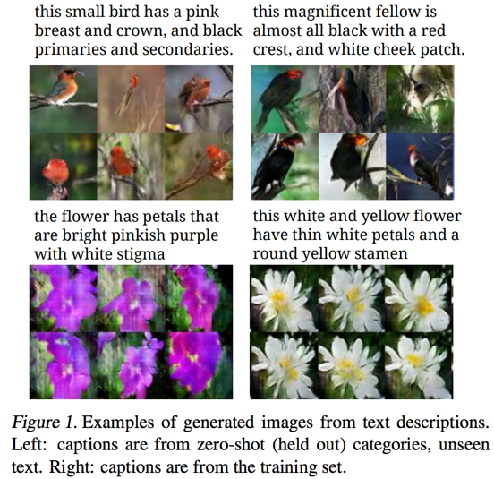
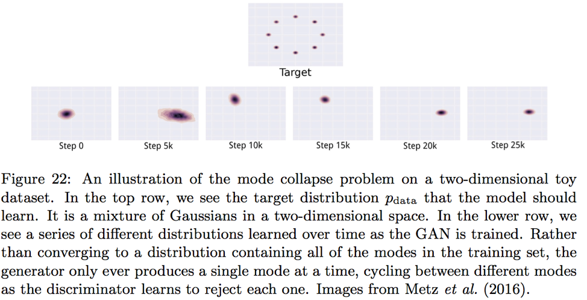

#### What are the major problems in GAN?
Some of the problems that researchers have attempted to address are non-convergence, lack of qualitative evaluation metrics and incapability to produce discrete outputs. The problems in GAN are not limited to these, but these are the more critical ones.

##### 1.	Mode collapse (Non-convergence)
###### What is Mode Collapse?
Non-convergence is a general problem that is often encountered with games. This occurs because the two players can undo each other’s optimization in simultaneous training. A common form of this problem in GAN is mode collapse, also called the Helvetica scenario, in which the generator learns to produce a small number of patterns that can fool the discriminator instead of learning to produce all of such patterns. Complete mode collapse, where all generated samples are nearly identical, is uncommon, but partial mode collapse where generated samples contain the same color or texture themes, or they are merely different views of the same object, is a common problem. Figure X shows an example introduced by M. Arjovsky et al. (Arjovsky 2017). 

There are cases when partial mode collapse is acceptable. One example is what is called the text-to-image synthesis, in which the algorithm generates images that match a text caption (Reed, 2016).  In the following figure, six images that all match the captions above are generated. 

###### Why does it occur?

###### How have researchers addressed this problem?
A. Minibatch features (Salimans et al., 2016)
B. Unrolled GANs (Metz et al., 2016)

##### 2. Lack of metrics for qualitative evaluation of generative models
##### 3. Incapability to produce discrete outputs
