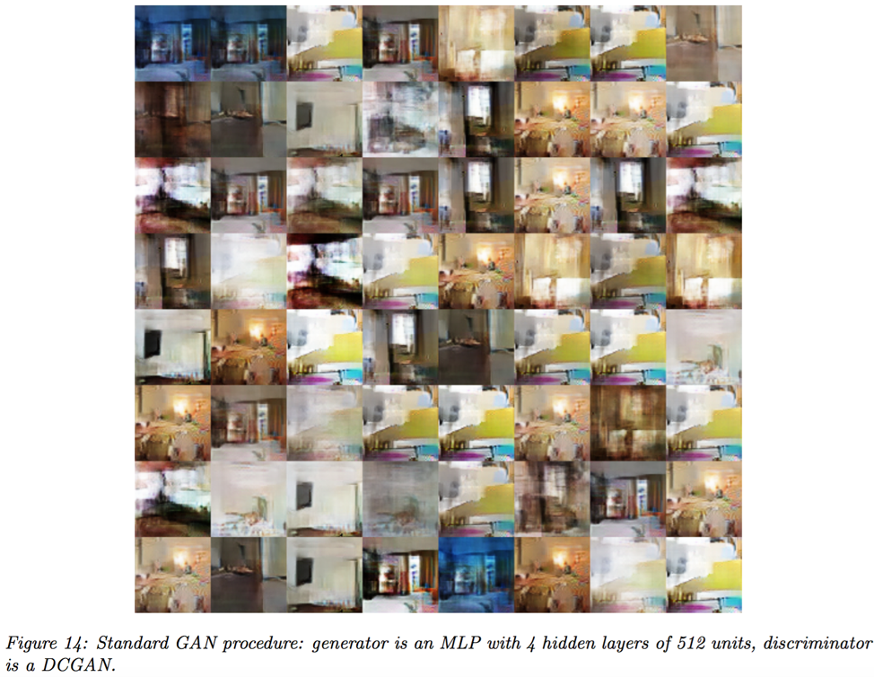

#### What are the major problems in GAN?
1.	Mode collapse (Non-convergence)

Non-convergence is a general problem that is often encountered with games. This occurs because the two players can undo each other’s optimization in simultaneous training. A common form of this problem in GAN is mode collapse, also called the Helvetica scenario, in which the generator learns to produce a single pattern that is able to fool the discriminator instead of learning to produce all of such patterns. Complete mode collapse, where all generated samples are nearly identical, is uncommon, but partial mode collapse where generated samples contain the same color or texture themes, or they are merely different views of the same object, is a common problem. Figure X shows an example introduced by M. Arjovsky et al. (Arjovsky 2017). 

